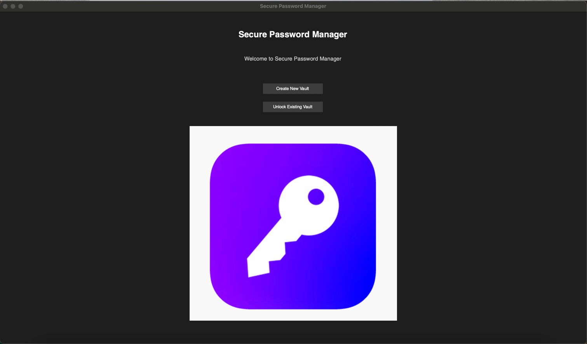

# Password Manager (AES)

A secure and user-friendly password management application built with Python and Tkinter, implementing AES-CBC encryption for password vault security.

## Overview

This Password Manager application provides a graphical user interface for securely storing, retrieving, and generating strong passwords. It uses advanced encryption techniques to ensure the protection of stored credentials with a master password-based access control system.


## Features

- **AES-CBC Encryption**: Secure 256-bit encryption for the password vault
- **Master Password Protection**: Single master password to access all stored credentials
- **Password Management**:
  - Store credentials (service, username, password, URL, notes)
  - Retrieve passwords securely
  - Edit existing entries
  - Delete credentials when no longer needed
- **Password Generation**: Create strong random passwords with customizable parameters
- **Password Strength Checker**: Real-time feedback on password strength
- **User-Friendly GUI**: Intuitive interface with search, categorization, and sorting capabilities
- **Clipboard Integration**: Copy passwords to clipboard with a single click
- **Secure Design**: Implements cryptographic best practices

## Security Implementation

- **Encryption Algorithm**: AES-CBC with 256-bit key
- **Key Derivation**: PBKDF2-HMAC-SHA256 with 100,000 iterations
- **Cryptographic Salt**: 16-byte random salt for key derivation
- **Initialization Vector**: Unique 16-byte IV for each encryption operation
- **PKCS#7 Padding**: Standard padding mechanism for AES block cipher
- **Secure Random Generation**: Using Python's `secrets` module for cryptographically strong random data

## Project Structure

### Core Modules

- **`main.py`**: Application entry point that initializes the GUI
- **`password_manager_gui.py`**: GUI implementation using Tkinter
- **`password_manager.py`**: Core logic for secure password management
- **`password_strength_checker.py`**: Password strength evaluation module

### Class Structure

#### PasswordManager Class
Handles all cryptographic operations and password management:
- Encryption/decryption of the vault
- Password storage and retrieval
- Password generation
- Master password management

#### PasswordManagerGUI Class
Provides the user interface:
- Login and vault creation
- Main password management interface
- Password addition, editing, and deletion
- Password generation dialog
- Settings and preferences

## Installation

### Prerequisites

- Python 3.6 or higher
- Required Python packages (see requirements.txt)

### Setup

1. Clone the repository:
   ```
   git clone https://github.com/yourusername/password-manager.git
   cd password-manager
   ```

2. Install dependencies:
   ```
   pip install -r requirements.txt
   ```

3. Run the application:
   ```
   python main.py
   ```

## Usage Guide

### First-Time Setup

1. Launch the application
2. Create a new vault with a strong master password
3. The main interface will appear after successful vault creation

### Adding Passwords

1. Click the "Add Password" button
2. Enter the service name, username, and password
3. Optionally add URL and notes
4. Use the password generator if needed
5. Click "Save" to store the credential

### Retrieving Passwords

1. Search for the desired credential using the search bar
2. Select the entry from the list
3. View details in the right panel
4. Click the copy button to copy the password to clipboard

### Managing Passwords

- **Edit**: Select an entry and click the edit button
- **Delete**: Select an entry and click the delete button
- **Generate New Password**: Use the password generator tool
- **Change Master Password**: Available in the Settings menu

## Security Considerations

- The master password is never stored in plaintext
- The entire vault file is encrypted
- Memory handling is designed to minimize exposure of sensitive data
- Regular updates are recommended to maintain security

## Future Enhancements

- Two-factor authentication support
- Cloud synchronization options
- Password health monitoring
- Browser integration
- Automatic password rotation
- Data breach monitoring

## Dependencies

- `tkinter`: GUI toolkit
- `pyperclip`: Clipboard operations
- `cryptography`: Cryptographic functions
- `os`, `json`, `secrets`, `string`, `re`: Standard Python libraries


## Acknowledgments

- Developed as part of CSD356 Foundation of Information Security course
- Implements security best practices for credential management

## Screenshots

### Landing Page


### Main Interface


### Password Addition with Strength Meter


### Password Generation

